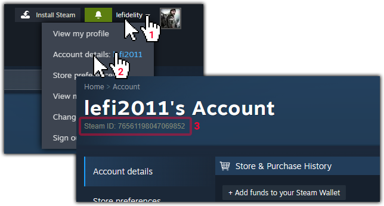
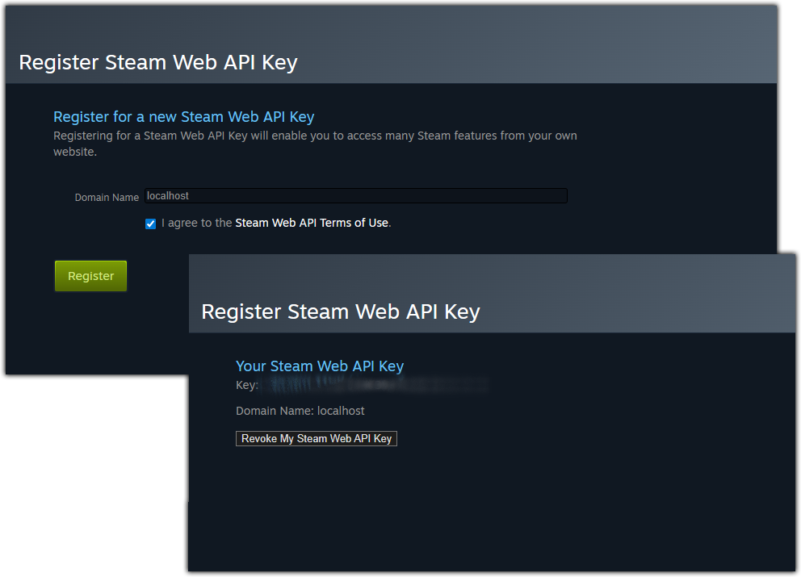

# Steam Tracker for Home Assistant

A Home Assistant custom integration that talks to the Steam Web API and exposes rich account and game telemetry as sensors. Keep an eye on your online status, the game you are playing, accumulated playtime, recent achievements, friends list, and more.

> Not affiliated with Valve or Steam. Use at your own risk.

---

## Features

- Player status: presence, avatar, profile link, timestamps
- Current game: title, app id, header art, total hours played
- Playtime summary: global totals, top five games, achievement progress
- Recently played: activity in the last two weeks with last played timestamp
- Recent achievements: unlocked versus total per game
- Global stats: completion ratios, badge counts, perfect games
- Friends: list of friends, their presence, and currently played titles

---

## Installation

### HACS (Recommended)
1. Open **HACS -> Integrations**.
2. Use the search bar to find **Steam Tracker** and install it.

Or click the badge below to open the repository page directly inside HACS:

[](https://my.home-assistant.io/redirect/hacs_repository/?owner=lefidelity&repository=hacs-steam-tracker&category=integration)

After installation, restart Home Assistant to load the integration.

### HACS (Manual Repository)
1. Open **HACS -> Integrations**.
2. Click the menu (three dots) in the top right and choose **Custom repositories**.
3. Paste `https://github.com/lefidelity/hacs-steam-tracker` and select **Integration**.
4. Click **Add**, then search for **Steam Tracker** and install it.
5. Restart Home Assistant.

### Manual Installation
1. Download the latest release and copy `custom_components/steam_tracker` into your Home Assistant configuration directory:
   ```
   config/custom_components/steam_tracker
   ```
2. Restart Home Assistant.

---

## Steam


The **Steam ID** and the **Steam Web API key** information is needed while configuring the integration. You need this two pieces of information before the integration can connect to Steam.

You also must **set some privacy settings** to get access to some informationen over the API.

### Steam Privacy Settings

To allow the **Steam Tracker** integration to retrieve your profile information, friends list, and playtime statistics, certain parts of your Steam account must be set to **Public**.  
If your profile or specific data fields are private, the Steam API will not return the required information — resulting in missing or empty sensors in Home Assistant.

#### Required privacy settings

Make sure the following settings are set to **Public** in your Steam profile:

| Setting | Required visibility | Purpose |
|----------|---------------------|----------|
| **My Profile** | Public | Allows the integration to access your general Steam user data (name, avatar, level, and last online time). |
| **Game Details** | Public | Needed to display your owned games, playtime, achievements, and most recently played games. |
| **Friends List** | Public | Required to show your Steam friends and their online status. |
| **Inventory** *(optional)* | Public | Only needed if you want to track badges, cards, or inventory-based stats. |

> ⚠️ **Note:** If your game details or friends list are private, the corresponding sensors will remain empty.

#### How to change your Steam privacy settings

1. Log in to your [Steam account](https://steamcommunity.com/).  
2. Click on your **profile name** in the top menu and select **View my profile**.  
3. Click **Edit Profile** → **Privacy Settings** (on the right-hand side).  
4. Under **My Profile**, set the following options to **Public**:
   - **My Profile** → Public  
   - **Game Details** → Public  
   - **Friends List** → Public  
   - *(Optional)* **Inventory** → Public  
5. Save your changes.

Once these settings are updated, your profile data will be accessible through the Steam Web API, and all sensors in the **Steam Tracker** integration will populate correctly.


### Your Steam ID (SteamID64)

1. Open your Steam profile in a browser.
2. Click on your profile name and then on **Account details** 
3. Under the title for your Steam account you'll see your **Steam ID** (SteamID64).



### Steam Web API Key

1. Visit [https://steamcommunity.com/dev/apikey](https://steamcommunity.com/dev/apikey).
2. Enter any domain (for example `localhost`) in the **Domain Name** field. At the moment it doesn't matter what domain you choose.
3. Accept the terms and click **Register** to generate your key.



Keep both the SteamID64 and the API key handy—you will enter them during the integration configuration.

---

## Configuration

Everything can be configured in the UI:

1. Navigate to **Settings -> Devices & Services -> Add Integration**.
2. Search for **Steam Tracker**.
3. Provide your **Steam User ID**, **Steam Web API key**, and a friendly **integration name**.

> ⚠️ **Note:** If you want to use the examples out of the box use the default "Steam Tracker" as the friendly name.

The integration creates sensors automatically with names based on the friendly name you choose. All examples will assume "Steam Tracker" as friendly name.

Already using `configuration.yaml`? Leave your existing entry in place for the first restart so Home Assistant can import it into the UI, then remove the YAML.

### Legacy YAML (optional)

```yaml
sensor:
  - platform: steam_tracker
    api_key: !secret steam_api_key
    steam_id: "7656119XXXXXXXXXX"
    name: "Steam Tracker"
```

---

## Examples

To get started quickly, the repository ships with two ready-to-use Lovelace dashboards and some Lovelace cards ready to use (if you use "Steam Tracker" as the integrations friendly name).

### Dashboards
- German version: `docs/examples/steam_dashboard_de.yaml`
- English version: `docs/examples/steam_dashboard_en.yaml`

[Documentation for the example dashboards](./docs/examples/extended%20dashboard/README.md)

### Lovelace cards

If you have used the default "Steam Tracker" as integrations friendly name you can copy and paste the YAML codes. For some cards additional integrations are needed (and are mentioned). Headlines or descriptive text (as seen in the example dashboards) are not provided with this examples.

- [Example Lovelace cards - German version](./docs/examples/cards/README_de.md)
- [Example Lovelace cards - English version](./docs/examples/cards/README_en.md)


## Provided Entities, Sensors and Attributes

### Entity IDs

Home Assistant slugifies the integration name. With the default `Steam Tracker` you will see:

- `sensor.steam_tracker_status`
- `sensor.steam_tracker_game`
- `sensor.steam_tracker_playtime`
- `sensor.steam_tracker_profile`
- `sensor.steam_tracker_recent`
- `sensor.steam_tracker_recent_achievements`
- `sensor.steam_tracker_global_stats`
- `sensor.steam_tracker_friends`

Renaming the integration (e.g., `My Steam Information`) produces matching entity IDs such as `sensor.my_steam_information_game`.

### Sensors and Attributes

### `sensor.*_status`
- **State**: `Offline | Online | Busy | Away | Snooze | Looking to trade | Looking to play | Unknown`
- **Attributes**: `personaname`, `profileurl`, `avatar`, `lastlogoff`

### `sensor.*_game`
- **State**: current game title or `none`
- **Attributes**: `gameid`, `name`, `personaname`, `logo`, `total_playtime_hours`

### `sensor.*_playtime`
- **State**: total playtime across all games (hours)
- **Attributes**: `top_5_games`, `all_games`, `game_count`, `total_playtime_hours`, `top_5_playtime_hours`, `playtime_by_gameid`, `pile_of_shame_count`

### `sensor.*_profile`
- **State**: Steam player level
- **Attributes**: `player_xp`, `player_xp_needed_to_level_up`, `player_xp_needed_current_level`

### `sensor.*_recent`
- **State**: most recent game or `none`
- **Attributes**: `recent_games` (list with `appid`, `name`, `playtime_2weeks_h`, `playtime_total_h`, `logo`, `last_played`), `game_count`

### `sensor.*_recent_achievements`
- **State**: number of games with achievement data
- **Attributes**: `recent_achievements` (list with `appid`, `name`, `unlocked`, `total`, `percent`, `logo`)

### `sensor.*_global_stats`
- **State**: total unlocked achievements
- **Attributes**: `achievements_total`, `achievements_possible`, `perfect_games`, `avg_completion_rate`, `badge_count`, `card_badge_count`

### `sensor.*_friends`
- **State**: number of Steam friends
- **Attributes**: `friends` (list with `steamid`, `personaname`, `avatar`, `profileurl`, `status`, `game`)

---

## Update Intervals

The update intervals can not be configured yet.

- Status: 1 minute
- Game: 5 minutes
- Recent games: 10 minutes
- Playtime, profile, recent achievements: 3 hours
- Global stats: 5 hours
- Friends: 5 minutes

Each sensor defines its own `SCAN_INTERVAL`.

---

## Privacy

- Secrets stay local to your Home Assistant instance.
- Only public Steam Web APIs are used.
- Never commit API keys or Steam IDs to source control.

---

## Roadmap

- Options flow for scan interval tuning
- Per-sensor enable/disable toggles
- Additional translations

---

## Contributing

Pull requests and issues are welcome. Please include:
- Steps to reproduce
- Home Assistant version
- Relevant logs (`custom_components.steam_tracker: debug`)
- Expected versus actual behavior

---

## License

MIT

---

## Changelog

**0.1.0**
- Initial release
- `sensor.*_game` exposes `total_playtime_hours`
- Top-5 list includes achievement counts and percentage
- Recently played sensor exposes `last_played` timestamp
